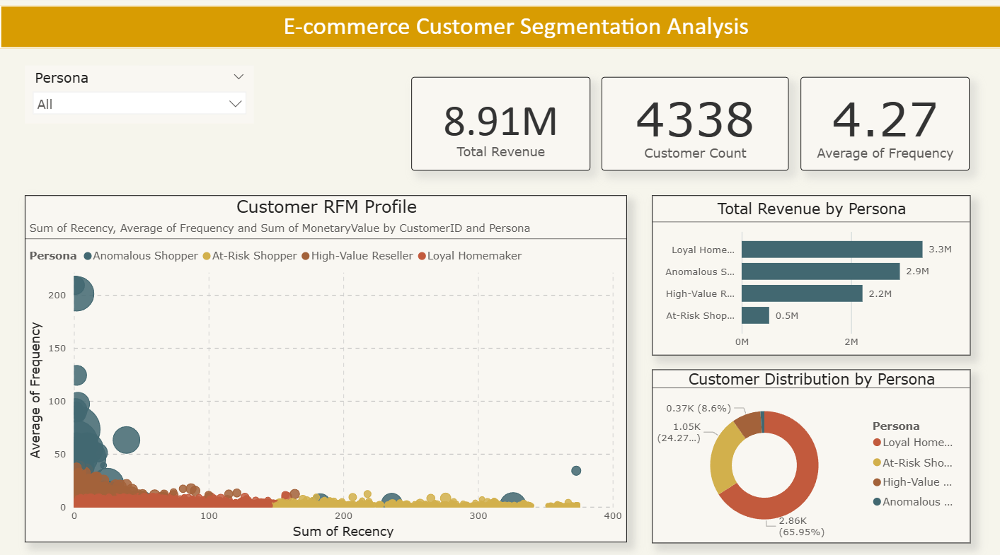

# Predictive Customer Segmentation using RFM Analysis

A customer segmentation project that combines SQL, Python, machine learning, and Power BI to identify meaningful customer groups based on purchasing behavior. The project uses RFM (Recency, Frequency, Monetary) analysis along with hybrid clustering to help businesses understand customer value and support data-driven marketing decisions.

---

## Project Overview

Understanding customer behavior is essential for improving retention and maximizing revenue. This project analyzes historical e-commerce transaction data to calculate RFM metrics for each customer and groups similar customers into actionable business personas.

The workflow includes:

- Extracting RFM metrics using SQL
- Data preprocessing in Python
- Customer segmentation using Hybrid Clustering (DBSCAN + K-Means)
- Segment validation using Silhouette Score
- Interactive dashboard creation in Power BI

---

## Tech Stack

- SQL
- Python
- Pandas
- NumPy
- Scikit-learn
- SQLite
- Power BI

---

## Project Workflow

### 1. Data Preparation
- Loaded transaction data into SQLite
- Filtered invalid transactions
- Generated customer-level purchase history

### 2. RFM Calculation
Calculated three customer behavior metrics:

- **Recency** – Days since the customer's last purchase
- **Frequency** – Number of unique purchases
- **Monetary** – Total amount spent by the customer

SQL was used to generate these metrics before further analysis.

### 3. Customer Segmentation

The RFM dataset was standardized before applying a hybrid clustering approach:

- DBSCAN for identifying outlier customers
- K-Means for clustering core customers
- Silhouette Score used to evaluate clustering quality

Each cluster was then analyzed and converted into business-friendly customer personas.

---

## Dashboard Highlights

The Power BI dashboard provides:

- Total Revenue
- Customer Count
- Average Purchase Frequency
- Revenue contribution by customer persona
- Customer distribution across segments
- Interactive RFM scatter visualization
- Persona-based filtering

---

## Files Included

```
customer_segment_analysis.ipynb     # Complete Python workflow
rfm_query.sql                       # SQL script for RFM calculation
customer_segments_final.csv         # Final segmented customer data
cust_segmentation_dashboard.pbix    # Power BI dashboard
dashboard_screenshot.png            # Dashboard preview
README.md
```

---

## Business Insights

The analysis identifies different customer personas based on purchasing behavior, including:

- Loyal Customers
- High-Value Customers
- At-Risk Customers
- Anomalous Shoppers

These segments can be used to:

- Improve customer retention
- Design targeted marketing campaigns
- Identify customers likely to churn
- Increase customer lifetime value
- Prioritize promotional strategies

---

## Dashboard Preview

> Add the dashboard screenshot below.



---

## Future Improvements

- Automate the complete ETL pipeline
- Deploy the dashboard online
- Add customer lifetime value prediction
- Build recommendation models for each customer segment
- Schedule automatic data refresh

---

## Key Skills Demonstrated

- Customer Segmentation
- RFM Analysis
- SQL Querying
- Data Cleaning
- Feature Engineering
- Machine Learning
- Cluster Analysis
- Business Intelligence
- Power BI Dashboard Development
